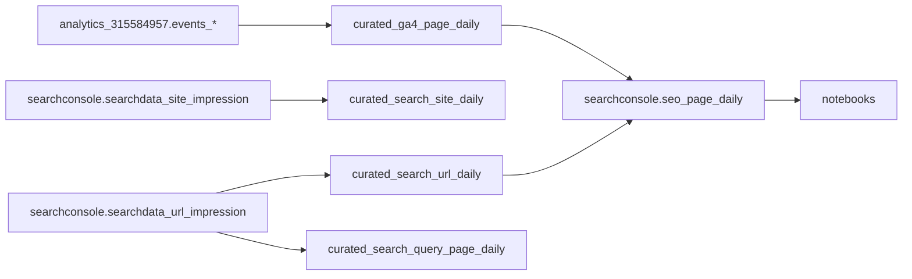

## Technical Details

A workspace for **Lifeline Australia’s Digital team** to analyse web traffic in BigQuery with notebooks.

The repo now supports two primary data sources:
- **GA4 export** for site traffic and engagement behavior
- **Google Search Console (GSC) bulk export** for search impressions, clicks, queries, and ranking trends

## Goal Of This Repo

Use notebooks to answer practical decisions:
- How much traffic is from search, and is that trend improving?
- Which pages get search visibility and traffic?
- Which queries drive each page?
- Which trends signal what to optimize (or stop optimizing)?

## Core Data Sources

- **Project:** `lifeline-website-480522`
- **GA4 dataset:** `analytics_315584957`
- **Search Console dataset:** `searchconsole`
- **Dataset location:** Sydney (`australia-southeast1`)

Expected GSC source tables:
- `searchconsole.searchdata_site_impression`
- `searchconsole.searchdata_url_impression`

## Canonical Table Map

For day-to-day analysis, treat these as canonical:

- `searchconsole.seo_page_daily` (default page-level SEO table for notebooks)
- `searchconsole.curated_search_query_page_daily` (query-level table when query terms are required)

Treat these as pipeline/internal layers:

- Raw live export: `searchconsole.searchdata_site_impression`, `searchconsole.searchdata_url_impression`
- Historical backfill: `searchconsole.searchdata_site_impression_backfill`, `searchconsole.searchdata_url_impression_backfill`
- Combined ingestion views: `searchconsole.searchdata_site_impression_all`, `searchconsole.searchdata_url_impression_all`
- Curated feeder tables: `searchconsole.curated_search_site_daily`, `searchconsole.curated_search_url_daily`

Practical usage:

- Use `seo_page_daily` for page-level trend and opportunity analysis.
- Use `curated_search_query_page_daily` for query/page movement analysis.
- Avoid querying `searchdata_*` directly unless validating ingestion or troubleshooting data gaps.

## Architecture



## What Is In This Repo

| Area | Description |
|------|-------------|
| `notebooks/` | Analysis notebooks. |
| `notebooks/templates/` | Reusable notebook starter template with BigQuery helpers and chart branding. |
| `sql/` | Curated model SQL for GA4, Search Console, and joined SEO reporting tables. |
| `lla_data/` | Shared Python helpers for config, BigQuery querying, and URL normalization. |
| `docs/` | Guardrails, metric definitions, and runbooks for reliable analysis. |
| `lifeline_theme.py` | Plotly theme and chart helpers for Lifeline visual style. |

## Prerequisites

- **Python 3.14** (see `.python-version`)
- **[uv](https://docs.astral.sh/uv/)** for dependency management
- **Google Cloud access** with BigQuery query permissions on `lifeline-website-480522`

## Setup

1. Clone repo:
   ```bash
   git clone <repo-url>
   cd lla-data
   ```
2. Install dependencies:
   ```bash
   uv sync
   ```
3. Authenticate locally for BigQuery:
   ```bash
   gcloud auth application-default login
   ```

## Running Notebooks

From project root:

```bash
uv run jupyter notebook notebooks/
```

## Curated SQL Models

### Search Console
- `sql/gsc_curated_site_daily.sql`
- `sql/gsc_curated_url_daily.sql`
- `sql/gsc_curated_query_page_daily.sql`

### GA4
- `sql/ga4_curated_page_daily.sql`
- `sql/ga4_curated_daily_traffic.sql` (existing category-level table)

### Joined SEO
- `sql/seo_page_daily.sql`

## Professional Guardrails

- Start with short date ranges while validating logic.
- Use dry runs before heavy queries.
- Prefer curated tables for repeated analysis; avoid scanning raw `events_*` unless required.
- Normalize page paths consistently when joining GA4 and GSC data.
- Keep notebook cells simple: parameters, SQL, output checks, chart.

More detail:
- `docs/ga4-bigquery-access-guardrails.md`
- `docs/searchconsole-data-dictionary.md`
- `docs/searchconsole-historical-backfill.md`
- `docs/seo-metrics-definitions.md`
- `docs/notebook-usage-guide.md`
- `docs/seo-first-run-checklist.md`