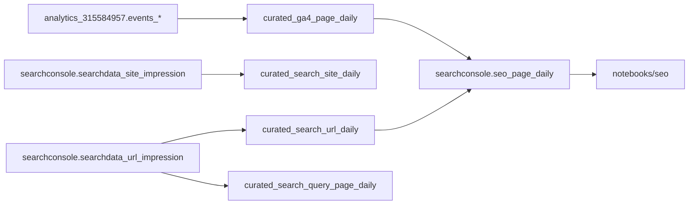

# LLA Data

## Start Here (No Technical Background Needed)

This project is a set of ready-to-run notebooks for understanding website performance (traffic, search visibility, and user behavior).

If you are new to coding, the easiest way to use this project is **Google Colab**. You can click a notebook link below and run it in your browser.

### Open In Colab

- **Search contribution over time**  
  [01_search_contribution_overview.ipynb](https://colab.research.google.com/github/aidanm-lla/lla-data/blob/main/notebooks/seo/01_search_contribution_overview.ipynb)
- **Top pages from search**  
  [02_top_pages_search_performance.ipynb](https://colab.research.google.com/github/aidanm-lla/lla-data/blob/main/notebooks/seo/02_top_pages_search_performance.ipynb)
- **Queries that drive a specific page**  
  [03_query_drivers_by_page.ipynb](https://colab.research.google.com/github/aidanm-lla/lla-data/blob/main/notebooks/seo/03_query_drivers_by_page.ipynb)
- **SEO opportunity watchlist**  
  [04_opportunity_watchlist.ipynb](https://colab.research.google.com/github/aidanm-lla/lla-data/blob/main/notebooks/seo/04_opportunity_watchlist.ipynb)
- **Top pages in the last 7 days**  
  [top_pages_last_7_days.ipynb](https://colab.research.google.com/github/aidanm-lla/lla-data/blob/main/notebooks/top_pages_last_7_days.ipynb)
- **Traffic source quality**  
  [traffic_sources.ipynb](https://colab.research.google.com/github/aidanm-lla/lla-data/blob/main/notebooks/traffic_sources.ipynb)
- **Time patterns for crisis-related pages**  
  [time_patterns.ipynb](https://colab.research.google.com/github/aidanm-lla/lla-data/blob/main/notebooks/time_patterns.ipynb)
- **Crisis support funnel**  
  [crisis_funnel.ipynb](https://colab.research.google.com/github/aidanm-lla/lla-data/blob/main/notebooks/crisis_funnel.ipynb)
- **Blank starter notebook**  
  [analysis_template.ipynb](https://colab.research.google.com/github/aidanm-lla/lla-data/blob/main/notebooks/templates/analysis_template.ipynb)

### Quick Getting Started (Colab)

1. Open any notebook link above.
2. Run the **Setup (run once)** cell.
3. If the notebook has a **Parameters** cell, edit the values (for example `DAYS_BACK = 28`).
4. Run the remaining cells from top to bottom.
5. Read the chart/table outputs and use them in your reporting.

### Project Link

- GitHub repo: [github.com/aidanm-lla/lla-data](https://github.com/aidanm-lla/lla-data)

## Technical Details

A workspace for **Lifeline Australia’s Digital team** to analyse web traffic in BigQuery with notebooks.

The repo now supports two primary data sources:
- **GA4 export** for site traffic and engagement behavior
- **Google Search Console (GSC) bulk export** for search impressions, clicks, queries, and ranking trends

## Goal Of This Repo

Use notebooks to answer practical decisions:
- How much traffic is from search, and is that trend improving?
- Which pages get search visibility and traffic?
- Which queries drive each page?
- Which trends signal what to optimize (or stop optimizing)?

## Core Data Sources

- **Project:** `lifeline-website-480522`
- **GA4 dataset:** `analytics_315584957`
- **Search Console dataset:** `searchconsole`
- **Dataset location:** Sydney (`australia-southeast1`)

Expected GSC source tables:
- `searchconsole.searchdata_site_impression`
- `searchconsole.searchdata_url_impression`

## Architecture



## What Is In This Repo

| Area | Description |
|------|-------------|
| `notebooks/` | Analysis notebooks. Includes existing GA4 notebooks and a new `notebooks/seo/` suite. |
| `notebooks/templates/` | Reusable notebook starter template with BigQuery helpers and chart branding. |
| `sql/` | Curated model SQL for GA4, Search Console, and joined SEO reporting tables. |
| `lla_data/` | Shared Python helpers for config, BigQuery querying, and URL normalization. |
| `docs/` | Guardrails, metric definitions, and runbooks for reliable analysis. |
| `lifeline_theme.py` | Plotly theme and chart helpers for Lifeline visual style. |

## Prerequisites

- **Python 3.14** (see `.python-version`)
- **[uv](https://docs.astral.sh/uv/)** for dependency management
- **Google Cloud access** with BigQuery query permissions on `lifeline-website-480522`

## Setup

1. Clone repo:
   ```bash
   git clone <repo-url>
   cd lla-data
   ```
2. Install dependencies:
   ```bash
   uv sync
   ```
3. Authenticate locally for BigQuery:
   ```bash
   gcloud auth application-default login
   ```

## Running Notebooks

From project root:

```bash
uv run jupyter notebook notebooks/
```

For most new analyses:
1. Start from `notebooks/templates/analysis_template.ipynb`
2. Query curated tables first
3. Use dry runs while developing SQL

## Notebook Catalog (Business-Question First)

### SEO / Search Console
- `notebooks/seo/01_search_contribution_overview.ipynb`  
  Track search contribution trends (clicks, impressions, organic sessions, search share).
- `notebooks/seo/02_top_pages_search_performance.ipynb`  
  Analyze top pages by search visibility and traffic quality.
- `notebooks/seo/03_query_drivers_by_page.ipynb`  
  Inspect which queries drive a chosen page.
- `notebooks/seo/04_opportunity_watchlist.ipynb`  
  Build an optimization watchlist from impressions, position, and CTR.

### Existing GA4 notebooks
- `notebooks/top_pages_last_7_days.ipynb`
- `notebooks/traffic_sources.ipynb`
- `notebooks/time_patterns.ipynb`
- `notebooks/crisis_funnel.ipynb`

## Curated SQL Models

### Search Console
- `sql/gsc_curated_site_daily.sql`
- `sql/gsc_curated_url_daily.sql`
- `sql/gsc_curated_query_page_daily.sql`

### GA4
- `sql/ga4_curated_page_daily.sql`
- `sql/ga4_curated_daily_traffic.sql` (existing category-level table)

### Joined SEO
- `sql/seo_page_daily.sql`

## Professional Guardrails

- Start with short date ranges while validating logic.
- Use dry runs before heavy queries.
- Prefer curated tables for repeated analysis; avoid scanning raw `events_*` unless required.
- Normalize page paths consistently when joining GA4 and GSC data.
- Keep notebook cells simple: parameters, SQL, output checks, chart.

More detail:
- `docs/ga4-bigquery-access-guardrails.md`
- `docs/searchconsole-data-dictionary.md`
- `docs/seo-metrics-definitions.md`
- `docs/notebook-usage-guide.md`
- `docs/seo-first-run-checklist.md`

## Data Freshness Note

Search Console export has a natural lag and your import only started recently, so early outputs will have sparse history. Prefer trend windows that match available data (for example, 7-28 days at the start), then expand as history accumulates.
